# Cerebro Architecture

Every tool, table, and background job Cerebro actually runs — from the four inbound channels, through ingress, cortex, the full 35-tool registry, tier gating, services, Postgres, and the seven scheduled jobs that carry state back out again.

Renders natively on GitHub. For the interactive/print versions see [`architecture.html`](architecture.html) and [`architecture.pdf`](architecture.pdf) in this same directory.

```mermaid
flowchart TB

    %% ==============================
    %% Inbound channels
    %% ==============================
    subgraph Channels["Communication Channels · Inbound"]
        direction LR
        SLACK[Slack]
        DISCORD[Discord]
        TELEGRAM[Telegram]
        MAIL[Mail]
    end

    GATEWAY["Caspian SDK Gateway<br/>single on_message handler"]
    Channels --> GATEWAY

    %% ==============================
    %% Ingress
    %% ==============================
    subgraph Ingress["Ingress Layer"]
        direction LR
        DEDUPE[Dedupe]
        PRINC[Resolve Principal]
        ENROLL1["Stage 1 · Team Code Prompt"]
        ENROLL2["Stage 2 · Population Default<br/>OPS self-serve · DEV / LEAD / ADMIN need peer sign-off"]
        CMD[Command Parser]
    end
    GATEWAY --> DEDUPE
    DEDUPE --> PRINC --> ENROLL1 --> ENROLL2 --> CMD

    %% ==============================
    %% Cortex
    %% ==============================
    subgraph Cortex["Cortex Decision Loop"]
        direction LR
        PROMPT["Build Prompt<br/>cortex/prompts.py"]
        FEATHER["Featherless Client<br/>Qwen / Llama · OpenAI-compatible"]
        LOOP["Tool-Calling Loop<br/>cortex/loop.py"]
        GATE["tools_for(population)<br/>population-gated set"]
    end
    CMD --> PROMPT --> FEATHER --> LOOP --> GATE

    %% ==============================
    %% Tool Registry - full 35 tools
    %% ==============================
    subgraph Registry["Tool Registry · 35 tools"]
        direction TB

        subgraph Identity["Identity & Onboarding"]
            direction LR
            WHOAMI[whoami]
            ENROLLP[enroll_principal]
            CREATETEAM[create_team]
        end

        subgraph Presence["Presence"]
            AVAIL[set_availability]
        end

        subgraph OrdersT["Orders"]
            direction LR
            OPENO[open_order]
            UPDO[update_order_fields]
            STATO[order_status]
            LISTO[list_orders]
        end

        subgraph TasksT["Tasks"]
            direction LR
            DECOMP[decompose_order]
            ASSIGNT[assign_task]
            ACKT[ack_task]
            BLOCKT[block_task]
            LISTT[list_tasks]
        end

        subgraph MeetingsT["Meetings"]
            direction LR
            SCHEDM[schedule_meeting]
            RSVPM[rsvp_meeting]
            LISTM[list_meetings]
            STATM[meeting_status]
            CANCELM[cancel_meeting]
        end

        subgraph RemindersT["Reminders"]
            direction LR
            DEADLINE[request_deadline]
            SETR[set_reminder]
            LISTR[list_reminders]
            CANCELR[cancel_reminder]
            CALVIEW[calendar_view]
        end

        subgraph SummariesT["Summaries"]
            REQS[request_summary]
            SUBS[submit_summary]
        end

        subgraph RelayT["Relay & Incidents"]
            direction LR
            RELAY[relay_to_population]
            FEEDBACK[route_client_feedback]
            INCIDENT[post_incident_update]
        end

        subgraph CIT["GitHub CI"]
            direction LR
            LISTCI[list_ci_runs]
            EXPLAIN[explain_ci_failure]
            RERUN[rerun_workflow]
            DISPATCH[dispatch_workflow]
            CANCELRUN[cancel_run]
        end

        subgraph JiraT["Jira"]
            CREATEJ[create_jira_ticket]
            STATUSJ[jira_issue_status]
        end
    end

    %% ==============================
    %% Tier executor, expanded with predicates
    %% ==============================
    subgraph Tier["Tier Executor"]
        direction LR
        T1["Tier 1<br/>runs immediately"]

        subgraph T2Group["Tier 2 · CONFIRM Challenge"]
            direction LR
            NONCE["Mint Nonce<br/>unambiguous alphabet"]
            PRED1["Predicate: alphabet ok"]
            PRED2["Predicate: approval exists"]
            PRED3["Predicate: same-channel confirm"]
            PRED4["Predicate: single-bound-channel"]
            PRED5["Predicate: correct principal"]
            AUDIT["Write Refusal Audit"]
        end
        NONCE --> PRED1 --> PRED2 --> PRED3 --> PRED4 --> PRED5 --> AUDIT
    end

    %% ==============================
    %% Services
    %% ==============================
    subgraph Services["Service Layer"]
        direction LR
        ORDERSVC[Orders Ledger]
        TASKSVC["Task Ladder<br/>designation -> skills -> wip_cap -> load"]
        MEETSVC[Meetings]
        REMSVC["Reminders + Deadlines"]
        SUMSVC["Summary Fan-in / Fan-out"]
        MEMSVC[Membrane Policy]
    end

    %% ==============================
    %% Membrane detail
    %% ==============================
    subgraph MembraneDetail["Membrane Crossing Pipeline"]
        direction LR
        EVAL["Evaluate Policy<br/>source -> target"]
        RECORD["Record Crossing<br/>audit-first"]
        REDACT["Redact Digest Text"]
        MARK["Mark Crossing Sent"]
    end
    EVAL --> RECORD --> REDACT --> MARK

    %% ==============================
    %% External integrations
    %% ==============================
    subgraph External["External Integrations"]
        direction LR
        GCAL["Google Calendar / Meet<br/>service-account auth"]
        ZOOM["Zoom<br/>server-to-server OAuth"]
        GITHUB["GitHub App<br/>installation auth"]
        JIRAAPI["Jira Cloud<br/>API token"]
    end

    %% ==============================
    %% Database - individual tables
    %% ==============================
    subgraph DB["PostgreSQL · SQLAlchemy models"]
        direction LR
        PRINCIPALSDB[(Principals)]
        ORGSDB[(Orgs)]
        BINDINGSDB[(Channel Bindings)]
        ROLECLAIMSDB[(Role Claims)]
        ORDERSDB[(Orders)]
        TASKSDB[(Tasks)]
        MEETINGSDB[(Meetings)]
        REMINDERSDB[(Reminders)]
        NUDGESDB[(Nudges)]
        CIRUNSDB[(CI Runs)]
        CIFAILDB[(CI Failures)]
        CROSSINGSDB[(Membrane Crossings)]
        APPROVALSDB[(Approvals)]
    end

    %% ==============================
    %% GitHub webhook pipeline
    %% ==============================
    subgraph Webhook["GitHub Webhook Pipeline"]
        direction LR
        SIG["Verify HMAC<br/>Signature"]
        NORM["Normalize<br/>CIEvent"]
        MATCH["Match Task<br/>Branch"]
        TRIAGE["Triage: slice log +<br/>fingerprint + flake budget"]
        PERSIST["Persist CiRun /<br/>CiFailure"]
    end
    SIG --> NORM --> MATCH --> TRIAGE --> PERSIST

    %% ==============================
    %% Background scheduler - all 7 jobs
    %% ==============================
    subgraph Scheduler["Background Scheduler · 5s ticks"]
        direction LR
        GAPCHASE[Gap Chase]
        LADDER[Task Ladder Escalation]
        MREM["Meeting Reminders<br/>24h / 60m / 10m"]
        GREM[General Reminders]
        SCHASE[Summary Chase]
        SMERGE[Summary Merge]
        INTAKE[Order Intake]
    end

    %% ==============================
    %% Frontend apps
    %% ==============================
    subgraph Dashboard["Frontend Apps"]
        direction LR
        ADMIN["FastAPI Admin API<br/>admin/router.py + auth"]
        NEXT["cerebro-web<br/>Team Dashboard"]
        CLIENTAPP["cerebro-client<br/>Telegram Mini App"]
    end
    ADMIN --> NEXT
    ADMIN --> CLIENTAPP

    %% ==============================
    %% Outbound delivery - a distinct terminal
    %% node, not a cycle back to Channels, so
    %% the layout never has to route a long
    %% edge back across the whole diagram
    %% ==============================
    subgraph OutboundDelivery["Outbound Delivery"]
        direction LR
        DELIVER["Nudges, reminders & notifications<br/>delivered back through the same<br/>Slack / Discord / Telegram / Mail channel"]
    end

    %% ==============================
    %% Main spine
    %% ==============================
    GATE --> Identity
    GATE --> Presence
    GATE --> OrdersT
    GATE --> TasksT
    GATE --> MeetingsT
    GATE --> RemindersT
    GATE --> SummariesT
    GATE --> RelayT
    GATE --> CIT
    GATE --> JiraT

    %% ==============================
    %% Registry -> Tier
    %% ==============================
    Identity --> T1
    Presence --> T1
    OrdersT --> T1
    TasksT --> T1
    MeetingsT --> T1
    RemindersT --> T1
    SummariesT --> T1
    RelayT --> T1
    LISTCI --> T1
    EXPLAIN --> T1
    RERUN --> NONCE
    DISPATCH --> NONCE
    CANCELRUN --> NONCE
    JiraT -- create / status --> T1

    %% ==============================
    %% Tier -> Services / External
    %% ==============================
    T1 --> Services
    AUDIT -- approved --> GITHUB
    AUDIT --> APPROVALSDB
    STATUSJ --> JIRAAPI
    CREATEJ --> JIRAAPI

    %% ==============================
    %% Services detail
    %% ==============================
    MEETSVC --> GCAL
    MEETSVC --> ZOOM
    MEMSVC --> EVAL

    %% ==============================
    %% Services -> DB
    %% ==============================
    PRINC --> PRINCIPALSDB
    CREATETEAM --> ORGSDB
    ENROLL1 --> BINDINGSDB
    ENROLL2 --> ROLECLAIMSDB
    ORDERSVC --> ORDERSDB
    TASKSVC --> TASKSDB
    TASKSVC --> NUDGESDB
    MEETSVC --> MEETINGSDB
    REMSVC --> REMINDERSDB
    REMSVC --> NUDGESDB
    SUMSVC --> ORDERSDB
    MARK --> CROSSINGSDB
    RelayT --> NUDGESDB
    PERSIST --> CIRUNSDB
    PERSIST --> CIFAILDB

    %% ==============================
    %% Webhook trigger
    %% ==============================
    GITHUB -. workflow_run webhook .-> SIG

    %% ==============================
    %% Scheduler reads DB
    %% ==============================
    DB --> Scheduler
    INTAKE -. auto-decompose .-> TASKSVC

    %% ==============================
    %% Dashboard reads DB
    %% ==============================
    DB --> ADMIN

    %% ==============================
    %% Everything async funnels to one
    %% outbound edge instead of looping
    %% each source back across the diagram
    %% ==============================
    Scheduler --> DELIVER
    PERSIST -- notify assignee --> DELIVER
    GATEWAY -. immediate reply .-> Channels
    DELIVER -. delivered via Gateway .-> Channels
```

